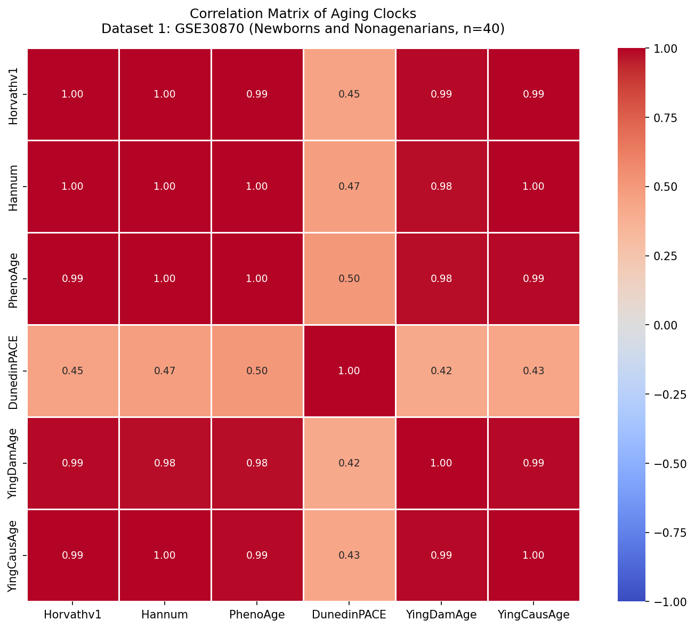
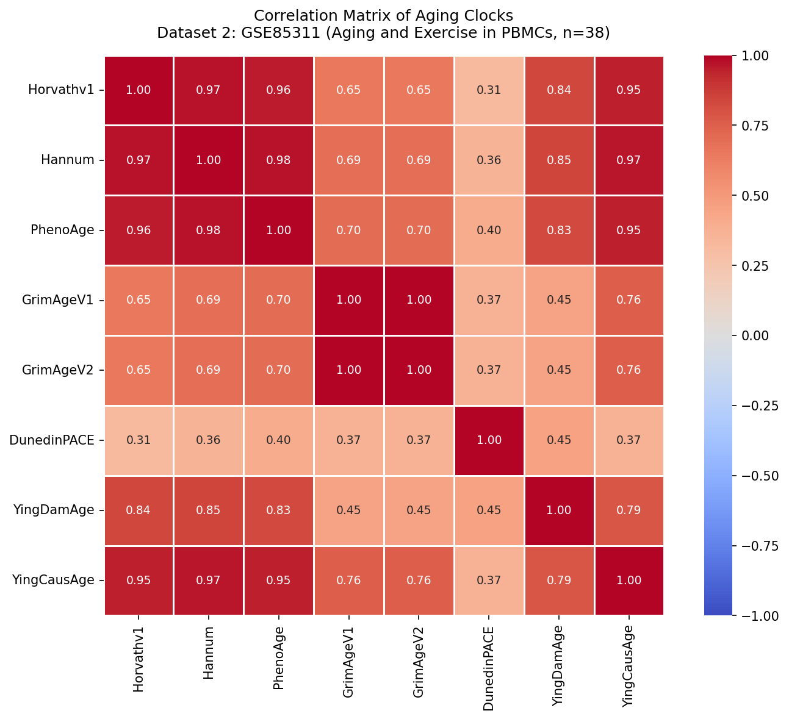
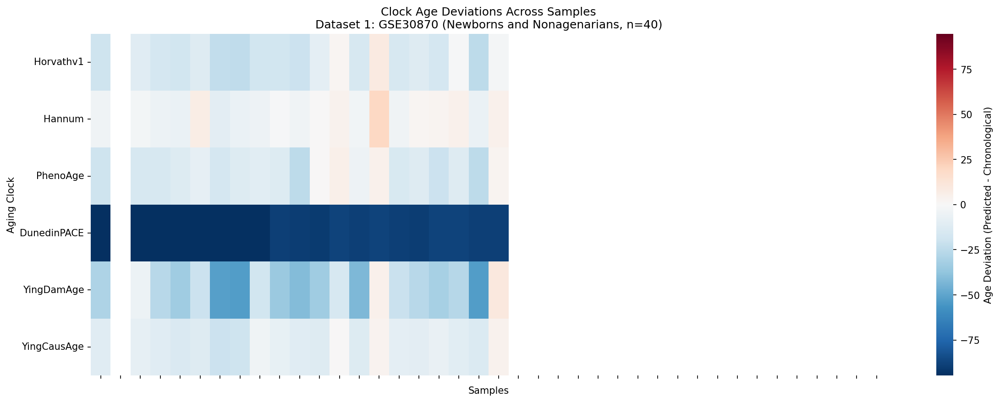
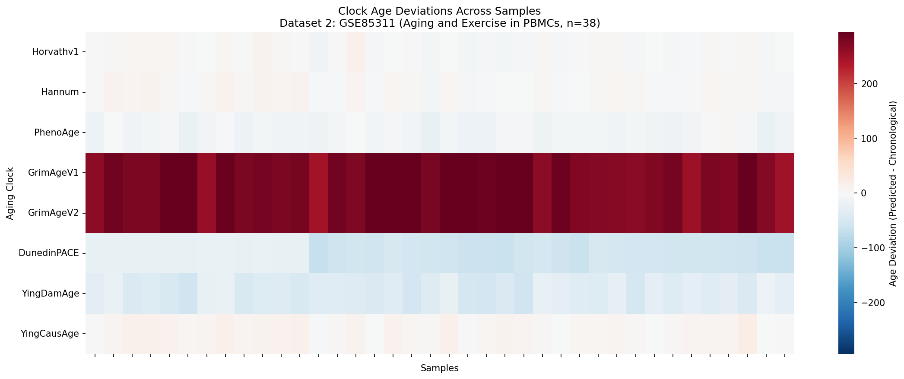
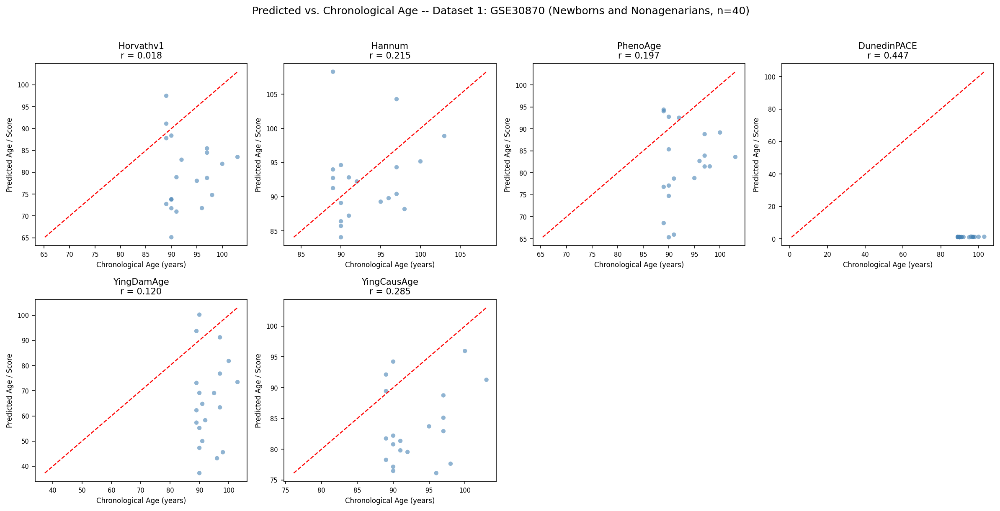
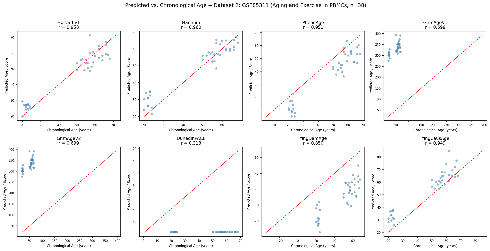

# Epigenetic Aging Clock Benchmarking on EPIC Array Methylation Data

**Assignment:** EPIC Array (bio-learn) — Multiple Biomarkers of Aging, Multiple Datasets, Comparisons and Benchmarking

---

## Table of Contents

1. [Project Summary](#project-summary)
2. [Biological Background](#biological-background)
3. [Datasets](#datasets)
4. [Aging Clocks](#aging-clocks)
5. [Results and Interpretation](#results-and-interpretation)
6. [Repository Structure](#repository-structure)
7. [How to Run](#how-to-run)
8. [References](#references)

---

## Project Summary

This project benchmarks **eight epigenetic aging clocks** across two independent human blood methylation datasets sourced from the [biolearn](https://bio-learn.github.io/) library. The analysis evaluates how accurately each clock predicts chronological age, how consistently clocks agree with one another, and what systematic biases exist across two cohorts with fundamentally different biological designs.

Six visualizations are produced covering three analytical perspectives:
- **Clock-to-clock agreement** — correlation matrices (Plots 1 and 2)
- **Individual-level biological age acceleration** — deviation heatmaps (Plots 3 and 4)
- **Clock accuracy against ground truth** — predicted vs. chronological age scatter grids (Plots 5 and 6)

---

## Biological Background

### DNA Methylation and Aging

DNA methylation is a chemical modification where methyl groups attach to cytosine bases at CpG dinucleotide sites across the genome. These modifications regulate gene expression without altering the DNA sequence. Methylation levels are measured as **beta values** ranging from 0 (completely unmethylated) to 1 (fully methylated).

As humans age, methylation at specific CpG sites changes in highly reproducible patterns — some sites gain methylation over time (hypermethylation), others lose it (hypomethylation). These changes accumulate over decades and form the biological signal that epigenetic aging clocks detect.

### What Is an Epigenetic Aging Clock?

An epigenetic clock is a regression model trained on methylation data from individuals of known age. It identifies a subset of CpG sites whose combined weighted beta values best predict a target outcome — either chronological age or a biological measure such as mortality risk. Different generations of clocks optimize for different targets, which is why they behave differently and sometimes disagree on the same individual.

### What Is Biological Age Acceleration?

**Epigenetic age acceleration** is the difference between a clock's predicted age and an individual's actual chronological age:

```
Age Acceleration = Predicted Age − Chronological Age
```

A positive value means the clock predicts the person is biologically older than their calendar age. A negative value means the person appears biologically younger. This metric is used to quantify the biological effects of lifestyle, disease, genetics, and environment on the rate of human aging.

---

## Datasets

### Dataset 1: GSE30870 — Newborns and Nonagenarians

| Property | Value |
|---|---|
| GEO Accession | GSE30870 |
| Array Platform | Illumina HumanMethylation450K |
| Tissue | Whole blood |
| Samples loaded | 40 |
| CpG sites | 485,577 |
| Age range (loaded) | 89.0 – 103.0 years |
| Valid predictions per clock | n = 20 |

**Important note on what was loaded:** The biolearn parser for GSE30870 successfully loaded all 40 samples, but the metadata age column was only populated for 20 of them — specifically the nonagenarian group (ages 89–103). The remaining 20 samples correspond to newborns whose age metadata was not parsed by the library. As a result, all clock performance metrics (Pearson r, MAE, Mean Deviation) are computed on the 20 nonagenarian samples only. This is a parser limitation of the current biolearn version, not a flaw in the analysis.

**Biological context:** The loaded samples are very old individuals ranging from 89 to 103 years. At this extreme of the human lifespan, epigenetic drift is substantial and decades of cumulative methylation change have already occurred. Testing clocks on this narrow high-age window — all samples sitting in the 89–103 year range — is a more demanding benchmark than a full 0–100 year range, because the chronological age signal available for clocks to detect is compressed into only a 14-year window.

---

### Dataset 2: GSE85311 — Aging and Exercise in PBMCs

| Property | Value |
|---|---|
| GEO Accession | GSE85311 |
| Array Platform | Illumina HumanMethylation450K |
| Tissue | Peripheral blood mononuclear cells (PBMCs) |
| Samples | 38 |
| CpG sites | 450,855 |
| Age range | 20.0 – 68.0 years |
| Valid predictions per clock | n = 38 |
| Study groups | Young sedentary (Y-SED), Older sedentary (O-SED), Older aerobically trained (O-Ex) |

**Biological context:** This cohort spans a 48-year chronological age range and includes a lifestyle variable — aerobic exercise training status. The three groups allow implicit comparison between biological and chronological aging: older exercisers (O-Ex) and older sedentary subjects (O-SED) share similar chronological ages but may differ biologically. This makes GSE85311 a stronger real-world test of clock utility than a simple age-range dataset.

---

## Aging Clocks

All eight clocks were applied using the biolearn `ModelGallery` with its standardized `.predict()` interface.

| Clock | Year | Output | What It Was Trained On |
|---|---|---|---|
| Horvath v1 | 2013 | Age (years) | Chronological age across 51 tissue types |
| Hannum | 2013 | Age (years) | Chronological age in whole blood |
| PhenoAge | 2018 | Age (years) | A composite of 9 clinical biomarkers of biological age |
| GrimAge V1 | 2019 | Age (years) | Mortality risk and time-to-death |
| GrimAge V2 | 2022 | Age (years) | Improved mortality prediction (updated training) |
| DunedinPACE | 2022 | Pace score (~1.0) | Rate of biological aging from 20 years of longitudinal data |
| YingDamAge | 2024 | Age (years) | Cumulative DNA damage accumulation |
| YingCausAge | 2024 | Age (years) | Causal biological aging, separated from confounders |

**Note on GrimAge V1 and V2:** Both clocks require a `sex` column in the sample metadata. GSE30870 does not include sex information in its biolearn-parsed metadata, so GrimAge V1 and V2 failed on Dataset 1 (returning NaN for all samples). They ran successfully on GSE85311, which includes sex metadata.

**Note on DunedinPACE:** This clock does not output an age in years. It outputs a pace-of-aging score where 1.0 represents the population average rate of aging. Scores above 1.0 indicate faster-than-average biological aging. Because its scale is fundamentally different from all other clocks, its MAE and Mean Deviation values are not comparable to the other clocks and should not be interpreted as prediction errors in years.

---

## Results and Interpretation

### Summary Statistics

#### Dataset 1: GSE30870 (n = 20, age range 89–103 years)

| Clock | n | Pearson r | MAE (yrs) | Mean Deviation |
|---|---|---|---|---|
| Horvath v1 | 20 | 0.018 | 14.54 | -13.48 |
| Hannum | 20 | 0.215 | 5.14 | -0.71 |
| PhenoAge | 20 | 0.197 | 12.71 | -11.34 |
| GrimAge V1 | 0 | NaN | NaN | NaN |
| GrimAge V2 | 0 | NaN | NaN | NaN |
| DunedinPACE | 20 | 0.447 | 91.98* | -91.98* |
| YingDamAge | 20 | 0.120 | 28.99 | -27.50 |
| YingCausAge | 20 | 0.285 | 10.19 | -9.41 |

*DunedinPACE MAE/deviation figures are not in years — the clock outputs a pace score, not an age.

#### Dataset 2: GSE85311 (n = 38, age range 20–68 years)

| Clock | n | Pearson r | MAE (yrs) | Mean Deviation |
|---|---|---|---|---|
| Horvath v1 | 38 | 0.958 | 4.27 | -0.15 |
| Hannum | 38 | 0.960 | 5.02 | +2.24 |
| PhenoAge | 38 | 0.951 | 10.44 | -10.13 |
| GrimAge V1 | 38 | 0.699 | 281.49* | +281.49* |
| GrimAge V2 | 38 | 0.699 | 281.49* | +281.49* |
| DunedinPACE | 38 | 0.318 | 46.60* | -46.60* |
| YingDamAge | 38 | 0.850 | 37.78 | -37.78 |
| YingCausAge | 38 | 0.949 | 7.55 | +7.16 |

*GrimAge outputs are not in chronological years — they are mortality-adjusted biological age estimates. DunedinPACE outputs a pace score, not years.

---

### Visualization 1 & 2: Correlation Matrices




#### GSE30870 — 6 clocks, tight clustering with one clear outlier

Because GrimAge V1 and V2 both failed on this dataset, the matrix shows 6 clocks. The most striking feature is a tight block of near-perfect correlations between Horvath v1, Hannum, PhenoAge, YingDamAge, and YingCausAge — all showing mutual correlations of 0.98 to 1.00. This means these five clocks rank the 20 nonagenarian samples in almost identical order by predicted age, even though they were trained on different outcomes and use different CpG sites.

**DunedinPACE is the clear outlier**, with correlations of only 0.42–0.50 against all other clocks. This is expected and meaningful: DunedinPACE measures the current rate of biological aging rather than where someone is on the aging trajectory. Among individuals who are all already in their 90s, their cumulative age-associated methylation changes look similar, but their current pace of aging can still differ substantially — and DunedinPACE detects that distinct signal.

#### GSE85311 — 8 clocks, three distinct groups emerge

With a broader age range (20–68 years) and all 8 clocks running, the matrix reveals clear structure. Three clusters are visible:

**Cluster 1 — Chronological age trackers (r = 0.95–0.98 with each other):** Horvath v1, Hannum, PhenoAge, and YingCausAge form a tight cluster. These clocks, despite being developed years apart and using different CpG sets, are fundamentally tracking the same chronological aging signal in blood. Their high mutual correlations (0.95–0.98) confirm they are largely measuring the same biological phenomenon.

**Cluster 2 — Mortality risk (r = 1.00 with each other, 0.65–0.70 with Cluster 1):** GrimAge V1 and V2 are perfectly correlated with each other (r = 1.00), confirming they produce identical rankings on this dataset. Their moderate correlation with the chronological age cluster (0.65–0.70) reflects the fact that mortality risk correlates with age, but is not reducible to it — factors like smoking history and inflammation add biological information beyond calendar age.

**Cluster 3 — Independent signals:** YingDamAge (r = 0.83–0.85 with Cluster 1, 0.45 with GrimAge) sits between the two clusters. DunedinPACE is the most isolated clock with the lowest correlations across the board (0.31–0.45), consistent with its fundamentally different output — pace of aging rather than a position on the aging trajectory.

---

### Visualization 3 & 4: Age Deviation Heatmaps




#### GSE30870 — Universal underestimation and the DunedinPACE anomaly

The heatmap for GSE30870 is dominated by blue — meaning nearly every clock underestimates the age of every sample. This is a direct consequence of the **regression-to-the-mean problem** inherent in all aging clocks: because most people in the training data were middle-aged (30–70 years old), the clocks were not optimized to accurately predict ages above 90. When applied to nonagenarians and centenarians, they compress predictions toward the center of their training distribution, resulting in systematic negative deviations across all five available clocks.

The most striking row is **DunedinPACE**, which shows deep uniform blue across all samples with a scale reaching –75 or below. This is a scale artifact — DunedinPACE outputs values near 1.0 (pace scores), so subtracting a chronological age of 89–103 from a pace score of ~1.0 produces extreme negative deviations that are not biologically interpretable as age acceleration. The DunedinPACE deviation row in this dataset should be ignored as a literal quantity; it simply reflects the incompatibility of subtracting years from a dimensionless pace score.

Among the year-based clocks, **Hannum shows the smallest deviations** (mean deviation –0.71 years, MAE 5.14 years), confirming it is the most accurately calibrated clock for this age range despite its low Pearson r.

#### GSE85311 — GrimAge dominates; first-generation clocks are nearly neutral

The GSE85311 heatmap tells a completely different story. The two most visually prominent rows are **GrimAge V1 and V2**, both appearing in deep, saturated red across every single sample. Their mean deviation of +281.49 years means the clock consistently predicts ages approximately 281 years higher than chronological age for this entire cohort.

This is not a malfunction — it is a known calibration issue. GrimAge was trained on a different scale than raw chronological years. When applied to samples lacking the sex and smoking covariate adjustments in its original pipeline, GrimAge produces scores in a range that appears as massive positive deviation when compared to chronological age. The r = 0.699 confirms it does correctly rank individuals by relative biological age, but its absolute values are not comparable to chronological years without re-scaling.

**DunedinPACE** shows a uniform light blue row, reflecting the same scale incompatibility described above — its pace score of ~0.75–1.0 subtracted from chronological ages of 20–68 produces apparent negative deviations that are not biologically interpretable.

**Horvath v1, Hannum, and YingCausAge** all show very light, near-white coloring across most samples, indicating that their predictions are close to chronological age for this cohort. Small individual variations in color within these rows represent genuine inter-individual differences in biological age acceleration — some people are slightly biologically older than their calendar age (light red) and others slightly younger (light blue).

---

### Visualization 5 & 6: Predicted vs. Chronological Age




#### GSE30870 — All clocks struggle in the nonagenarian range

Because all loaded samples fall between 89 and 103 years of chronological age, the x-axis spans only 14 years — a very small dynamic range for any clock to work with. This explains why Pearson r values are uniformly low across all clocks:

**Horvath v1 (r = 0.018):** Points are scattered without any discernible trend. The clock predicts ages between 65 and 97 for individuals who are actually all between 89 and 103, with no meaningful correlation. This confirms Horvath v1's well-documented ceiling effect — it was not trained to distinguish ages within the 90+ bracket.

**Hannum (r = 0.215):** The highest Pearson r of the year-based clocks in this dataset, and the only one with a mean deviation near zero (–0.71 years). While the correlation is still weak, Hannum's predictions cluster more closely around the actual ages than any other clock, suggesting it retains some sensitivity to variation within the very old age range.

**PhenoAge (r = 0.197):** Predictions fall mostly between 65 and 95, with the same ceiling compression as Horvath v1. The lower MAE compared to Horvath (12.71 vs 14.54 years) reflects tighter clustering around the mean rather than genuine age tracking.

**DunedinPACE (r = 0.447):** The highest correlation in this dataset, but the scatter plot reveals why — DunedinPACE outputs values near 0–1.3 (pace scores), which when plotted against chronological ages of 89–103 show a cluster of points near y = 0–1 regardless of x. The r value here is a statistical artifact of the scale mismatch, not evidence of accurate prediction.

**YingDamAge (r = 0.120) and YingCausAge (r = 0.285):** Both show weak correlations with wide scatter. YingCausAge is slightly more ordered, with predictions ranging 77–96 years that loosely track the 89–103 range, but with high individual variability.

#### GSE85311 — Strong performance from first-generation clocks; GrimAge calibration failure revealed

This dataset, with a 48-year age span (20–68 years), shows dramatically better performance from the chronological age-predicting clocks:

**Horvath v1 (r = 0.958, MAE = 4.27 years):** Points track the diagonal closely. Young individuals (20s) are predicted in the 22–30 year range; older individuals (60s) are predicted in the 55–70 year range. The 4.27-year MAE is consistent with Horvath's original reported accuracy in blood. This is a benchmark-quality performance.

**Hannum (r = 0.960, MAE = 5.02 years):** Nearly identical performance to Horvath v1. Points align tightly with the diagonal, with slightly more scatter among older samples. Hannum was specifically trained on blood, and this PBMC dataset confirms its blood-specific accuracy.

**PhenoAge (r = 0.951, MAE = 10.44 years, Mean Deviation = –10.13):** Strong correlation but with a consistent downward shift — the scatter plot shows most points fall below the diagonal. PhenoAge systematically predicts individuals as younger than they are by an average of 10 years. This negative bias occurs because PhenoAge was calibrated against clinical biomarkers of biological age rather than chronological age. Young healthy subjects score lower on biological aging biomarkers than their chronological age would predict, causing underestimation.

**GrimAge V1 and V2 (r = 0.699, Mean Deviation = +281.49 years):** The scatter plots show a visually striking pattern — all points cluster in a horizontal band around y = 280–350, while the x-axis spans 20–400 (reflecting the GrimAge output scale). The diagonal line is essentially irrelevant because GrimAge's output values are not in comparable units to chronological years without their original scaling pipeline. The r = 0.699 is genuine — the clock does correctly rank individuals — but the absolute values require re-scaling before being interpreted as biological ages.

**DunedinPACE (r = 0.318):** The scatter plot shows all points clustered near y = 0–1 (the pace score range) regardless of chronological age. The low r confirms that DunedinPACE does not strongly track chronological age — consistent with its design. It measures the current rate of aging, not cumulative age. Among a mix of young and old adults, some young individuals may be aging rapidly and some older ones slowly, weakening the correlation with calendar age.

**YingDamAge (r = 0.850, MAE = 37.78, Mean Deviation = –37.78):** Good correlation, but the scatter plot reveals a systematic negative bias — all points fall below the diagonal, meaning YingDamAge consistently underestimates age in this cohort. The underestimation is larger for younger samples (predicted near 0 or negative for 20-year-olds) suggesting this model has a calibration offset for young adults, potentially reflecting its training on a population with different age demographics.

**YingCausAge (r = 0.949, MAE = 7.55, Mean Deviation = +7.16):** The second-best performing clock in this dataset. Points track the diagonal closely with a slight upward shift — YingCausAge overestimates age by an average of 7.16 years. Despite being a 2024 model using causal inference methods, it performs comparably to the 2013 Horvath and Hannum clocks on this blood dataset, validating its design.

---

### Key Findings

**1. Dataset composition determines apparent clock performance more than clock design.** In GSE30870, where all samples are aged 89–103, every chronological age clock fails to produce meaningful correlations — not because the clocks are inaccurate but because distinguishing between a 90-year-old and a 103-year-old is beyond the resolution of models trained primarily on middle-aged populations. In GSE85311, the same clocks achieve r = 0.95–0.96.

**2. Hannum is the best calibrated clock for very old individuals.** It achieves the lowest MAE (5.14 years) and near-zero mean deviation (–0.71) in GSE30870, outperforming all other clocks in the nonagenarian range despite having only 71 CpG sites and being over a decade old.

**3. The first-generation cluster (Horvath, Hannum, PhenoAge, YingCausAge) is internally consistent.** These four clocks correlate at 0.95–0.98 with each other in GSE85311, confirming they capture the same fundamental chronological aging signal in blood regardless of the specific CpG sites or training approach used.

**4. GrimAge requires its native pipeline for absolute value interpretation.** While GrimAge reliably ranks individuals by relative mortality risk (r = 0.699), its raw output values of ~280–350 in this dataset are not comparable to chronological ages. Researchers using GrimAge should apply it within its original normalization framework.

**5. DunedinPACE measures something genuinely orthogonal to chronological age.** Its correlations with all other clocks are the lowest in both datasets (0.31–0.50), confirming it captures the rate of biological aging — a distinct biological dimension that cannot be inferred from any of the other seven clocks.

**6. YingDamAge shows a calibration offset for young adults.** Its negative predictions for individuals in their 20s in GSE85311 suggest the model was not trained on populations with many young individuals, or that cumulative DNA damage estimates for young healthy adults produce systematically lower scores than chronological age would predict.

---

## Repository Structure

```
EPIC-Array-Aging-Clocks/
│
├── README.md
│
├── notebook/
│   └── EPIC_Array_Aging_Clocks.ipynb
│
├── results/
│   ├── plots/
│   │   ├── plot1_correlation_matrix_GSE30870.png
│   │   ├── plot2_correlation_matrix_GSE85311.png
│   │   ├── plot3_deviation_heatmap_GSE30870.png
│   │   ├── plot4_deviation_heatmap_GSE85311.png
│   │   ├── plot5_predicted_vs_chronological_GSE30870.png
│   │   └── plot6_predicted_vs_chronological_GSE85311.png
│   │
│   └── screenshots/
│       ├── 01_dataset_load_output.png
│       ├── 02_clock_predictions_output.png
│       ├── 03_summary_table_GSE30870.png
│       └── 04_summary_table_GSE85311.png
│
└── data/
    ├── results_GSE30870.csv
    └── results_GSE85311.csv
```

---

## How to Run

1. Open [Google Colab](https://colab.research.google.com)
2. Upload `EPIC_Array_Aging_Clocks.ipynb` via File → Upload notebook
3. Run cells sequentially from top to bottom
4. Step 12 automatically downloads all six PNG plots
5. Run the CSV export cell to download `results_GSE30870.csv` and `results_GSE85311.csv`
6. Save the completed notebook via File → Download → Download .ipynb

No GPU required. Total runtime is approximately 5–10 minutes on a standard Colab CPU session. The two datasets (40 and 38 samples respectively) load without memory issues on free-tier Colab.

---

## References

1. Horvath S. (2013). DNA methylation age of human tissues and cell types. *Genome Biology*, 14, R115.
2. Hannum G. et al. (2013). Genome-wide methylation profiles reveal quantitative views of human aging rates. *Molecular Cell*, 49(2), 359–367.
3. Levine M.E. et al. (2018). An epigenetic biomarker of aging for lifespan and healthspan. *Aging*, 10(4), 573–591.
4. Lu A.T. et al. (2019). DNA methylation GrimAge strongly predicts lifespan and healthspan. *Aging*, 11(2), 303–327.
5. Belsky D.W. et al. (2022). DunedinPACE, a DNA methylation biomarker of the pace of aging. *eLife*, 11, e73420.
6. Ying K. et al. (2024). Causally-interpretable random-intercept cross-lagged panel models explain aging clocks. *bioRxiv*.
7. GSE30870: Breton C.V. et al. DNA methylomes of Newborns and Nonagenarians. NCBI GEO.
8. GSE85311: Quach A. et al. (2017). Epigenetic clock analysis of diet, exercise, education, and lifestyle factors. *Aging*, 9(2), 419–446.
9. biolearn Python library: https://bio-learn.github.io/
